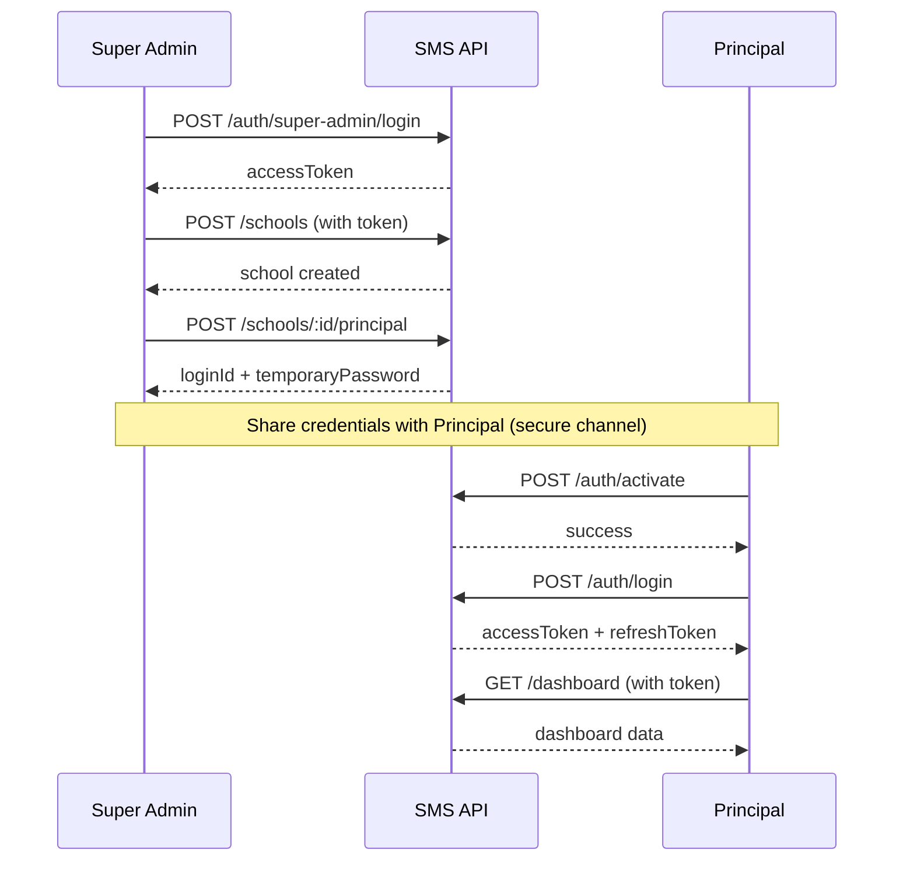

# Super Admin Authentication

## Overview

Super Admin is a **platform-level identity** for managing schools and provisioning principals. It exists outside the normal school user hierarchy and has no school tenant.

**Security Model:**
- Platform-level access (not school-scoped)
- No user record in `users` table
- No session/refresh token (access token only, 15min expiry)
- Token version-based revocation
- Credentials stored in Worker secrets

---

## Configuration

### Required Secrets

Three Worker secrets are required for Super Admin authentication:

1. **SUPER_ADMIN_LOGIN_ID** - Login identifier
2. **SUPER_ADMIN_PASSWORD_HASH** - scrypt password hash
3. **SUPER_ADMIN_TOKEN_VERSION** - Token version for revocation

### Local Development Setup

1. Copy the example file:
   ```bash
   cp .dev.vars.example .dev.vars
   ```

2. Generate a password hash:
   ```bash
   # Using Node.js
   node --input-type=module -e "
   import { hashPassword } from './src/auth/password.service.js';
   hashPassword('YourSecurePassword123!').then(console.log);
   "
   ```

3. Update `.dev.vars` with your values:
   ```bash
   JWT_SECRET=your-jwt-secret
   SUPER_ADMIN_LOGIN_ID=super-admin
   SUPER_ADMIN_PASSWORD_HASH=scrypt$16384:8:1$...
   SUPER_ADMIN_TOKEN_VERSION=1
   ```

4. **NEVER commit `.dev.vars` to version control** (it's gitignored)

### Production Deployment

Set secrets using Wrangler CLI:

```bash
# Set Super Admin login ID
wrangler secret put SUPER_ADMIN_LOGIN_ID

# Set Super Admin password hash
wrangler secret put SUPER_ADMIN_PASSWORD_HASH

# Set initial token version
wrangler secret put SUPER_ADMIN_TOKEN_VERSION
# Enter: 1
```

### Password Requirements

Passwords must meet these requirements:
- At least 8 characters
- At least one uppercase letter
- At least one lowercase letter
- At least one number
- At least one special character

---

## Authentication Flow

### Login

**Endpoint:** `POST /auth/super-admin/login`

**Request:**
```json
{
  "loginId": "super-admin",
  "password": "YourPassword123!"
}
```

**Success Response (200):**
```json
{
  "accessToken": "eyJhbGc..."
}
```

**Error Response (401):**
```json
{
  "error": "Invalid credentials"
}
```

**Token Properties:**
- Type: JWT (HS256)
- Expiry: 15 minutes
- No refresh token
- Must re-login after expiry

### Token Structure

**JWT Claims:**
```json
{
  "sub": "super-admin",
  "role": "super_admin",
  "tokenVersion": 1,
  "iat": 1735689600,
  "exp": 1735690500
}
```

**Note:** Super Admin tokens have NO `schoolId`, `userId`, or `sessionId`.

### Using the Token

Include in Authorization header:

```http
Authorization: Bearer eyJhbGc...
```

---

## Authorization

### Allowed Operations

Super Admin can ONLY access platform-level endpoints:

✅ **POST /schools** - Create school
✅ **GET /schools** - List schools
✅ **GET /schools/:id** - Get school details
✅ **PUT /schools/:id** - Update school
✅ **POST /schools/:id/suspend** - Suspend school
✅ **POST /schools/:id/activate** - Activate school
✅ **POST /schools/:id/archive** - Archive school
✅ **POST /schools/:id/principal** - Create principal

### Denied Operations

Super Admin CANNOT access school-user endpoints:

❌ `/students` - School-scoped
❌ `/teachers` - School-scoped
❌ `/attendance` - School-scoped
❌ `/marks` - School-scoped
❌ `/fees` - School-scoped
❌ `/assignments` - School-scoped
❌ `/classrooms` - School-scoped
❌ Any other school-tenant endpoint

**Reason:** Super Admin is platform-level only. School operations require Principal/Teacher/Student accounts.

---

## Token Revocation

### Version-Based Revocation

To invalidate all Super Admin tokens without changing the global JWT secret:

1. Increment `SUPER_ADMIN_TOKEN_VERSION`:
   ```bash
   wrangler secret put SUPER_ADMIN_TOKEN_VERSION
   # Enter: 2
   ```

2. All tokens with version `1` are now invalid
3. New logins will receive tokens with version `2`

### Use Cases

- Suspected credential compromise
- Routine security rotation
- Administrative access revocation
- Insider threat response

**Note:** Does NOT affect school user sessions (they use `users.token_version`).

---

## Security Features

### Credential Protection

✅ **Constant-time verification** - Prevents timing attacks
✅ **Generic error messages** - Never reveals which credential failed
✅ **Fail-closed configuration** - Missing secrets cause authentication failure
✅ **No defaults** - No fallback credentials
✅ **No user enumeration** - Same error for all failure cases

### Token Security

✅ **Short-lived tokens** - 15-minute expiry forces re-authentication
✅ **Version-based revocation** - Can invalidate without global secret rotation
✅ **Platform-scoped** - Cannot access school data
✅ **JWT signature** - Same signing key as school users
✅ **Fixed subject** - `sub: "super-admin"` cannot collide with user IDs

### Authorization Security

✅ **Dual validation** - Checks both role AND absence of school tenant
✅ **No privilege escalation** - School users cannot become Super Admin
✅ **No cross-boundary access** - Super Admin cannot access school endpoints
✅ **Context validation** - Rejects forged tokens with mixed context

---

## Audit Logging

### Successful Login

```json
{
  "event": "LOGIN_SUCCESS",
  "requestId": "req-123",
  "userId": "super-admin",
  "role": "super_admin",
  "durationMs": 45
}
```

### Failed Login

```json
{
  "event": "LOGIN_FAILURE",
  "requestId": "req-124",
  "role": "super_admin",
  "reasonCode": "INVALID_CREDENTIALS",
  "durationMs": 42
}
```

**Note:** Passwords are NEVER logged.

---

## Bootstrap Flow

Complete flow from Super Admin to working Principal dashboard:



### Step-by-Step

1. **Super Admin logs in:**
   ```bash
   POST /auth/super-admin/login
   {
     "loginId": "super-admin",
     "password": "YourPassword123!"
   }
   ```

2. **Super Admin creates school:**
   ```bash
   POST /schools
   Authorization: Bearer <super-admin-token>
   {
     "code": "GPS",
     "name": "Greenwood Public School"
   }
   ```

3. **Super Admin provisions Principal:**
   ```bash
   POST /schools/{schoolId}/principal
   Authorization: Bearer <super-admin-token>
   {
     "full_name": "Dr. Priya Sharma",
     "date_of_birth": "1975-06-15",
     "gender": "female"
   }
   ```

   Response:
   ```json
   {
     "data": {
       "user_id": "01JGABC...",
       "login_id": "GPS-P-000001",
       "temporary_password": "X7k9#mP2$vN4@qR6"
     }
   }
   ```

4. **Principal activates account:**
   ```bash
   POST /auth/activate
   {
     "loginId": "GPS-P-000001",
     "activationCode": "X7k9#mP2$vN4@qR6",
     "newPassword": "SecurePass@123"
   }
   ```

5. **Principal logs in:**
   ```bash
   POST /auth/login
   {
     "loginId": "GPS-P-000001",
     "password": "SecurePass@123"
   }
   ```

6. **Principal accesses dashboard:**
   ```bash
   GET /students
   Authorization: Bearer <principal-token>
   ```

---

## Pre-Production Requirements

⚠️ **MANDATORY before production deployment:**

### 1. Rate Limiting

Implement rate limiting on `/auth/super-admin/login`:
- **Recommended:** 5 attempts per IP per 15 minutes
- **Implementation:** Use Cloudflare Rate Limiting or Workers KV
- **Action:** Block or CAPTCHA after threshold

### 2. IP Whitelisting (Optional)

Consider restricting Super Admin access:
- Admin VPN IPs only
- Corporate network range
- Specific trusted IPs

### 3. MFA (Recommended)

Add multi-factor authentication:
- TOTP (Time-based One-Time Password)
- Hardware security keys
- SMS verification (less secure)

### 4. Monitoring & Alerting

Set up alerts for:
- Failed Super Admin login attempts
- Successful Super Admin logins
- Super Admin token version changes
- School creation/modification

### 5. Access Logging

Log ALL Super Admin operations:
- Who accessed what
- When they accessed it
- What changes were made
- Source IP address

---

## Troubleshooting

### "Invalid credentials" on correct password

**Possible causes:**
1. Password hash not matching format
2. Token version mismatch
3. Secret not configured
4. Secret has whitespace/formatting issues

**Solutions:**
- Verify secret is properly set
- Regenerate password hash
- Check token version is integer
- Ensure no trailing whitespace in secrets

### "Authentication failed" instead of "Invalid credentials"

**Cause:** Configuration issue (missing/malformed secrets)

**Solution:**
- Check all three secrets are set
- Verify token version is valid integer
- Check JWT_SECRET is present

### Token expired immediately

**Cause:** System clock skew

**Solution:**
- Verify server time is correct
- Check timezone settings
- Use NTP for time sync

### Cannot access school endpoints

**Expected:** Super Admin is platform-level only

**Solution:**
- Use school user (Principal/Teacher) for school operations
- Super Admin is ONLY for platform management

---

## Security Considerations

### Do NOT

❌ Share Super Admin credentials
❌ Use weak passwords
❌ Store credentials in code
❌ Commit `.dev.vars` to version control
❌ Use Super Admin for routine school operations
❌ Create multiple Super Admin accounts
❌ Log passwords or tokens
❌ Expose Super Admin endpoints publicly without protection

### DO

✅ Use strong, unique passwords
✅ Rotate credentials regularly
✅ Use token version for revocation
✅ Monitor Super Admin access
✅ Restrict network access (VPN/IP whitelist)
✅ Use MFA in production
✅ Limit Super Admin use to platform tasks only
✅ Audit all Super Admin operations

---

## API Reference

See `SUPER_ADMIN_VERIFICATION_REPORT.md` for complete API contracts and example requests.
